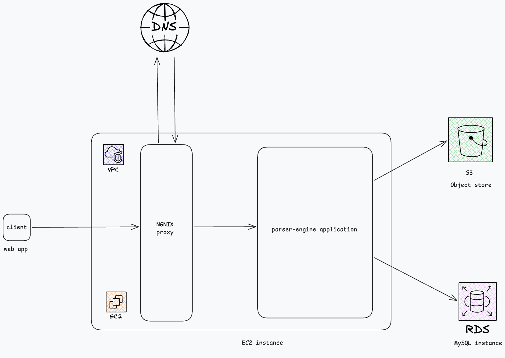

# Parser Engine (Monorepo)

This repository contains:

- `backend/`: Spring Boot (Java 17) API for authentication, file upload/processing, and property management.
- `frontend/`: Vite + React dashboard UI that talks to the backend API.

## Repo structure

```text
parser-engine/
  backend/
  frontend/
  .github/workflows/
  docker-compose.yml
```

## Quick start (local)

### 1) Start MySQL

From repo root:

```bash
docker compose up -d mysql
```

### 2) Run backend

```bash
cd backend
./mvnw spring-boot:run -Dspring-boot.run.profiles=dev
```

Backend base URL: `http://localhost:8080/parser-engine`

### 3) Run frontend (development)

From repo root:

```bash
cd frontend
npm install
cp .env.example .env.local
# Optional: edit .env.local if the API is not at http://localhost:8080/parser-engine
npm run dev
```

The Vite dev server defaults to **http://localhost:5173**. Ensure the backend CORS configuration allows this origin (see `backend/.../SecurityConfig.java`).

### Frontend compilation (TypeScript check + production bundle)

All commands below are run from `frontend/` after `npm install`.

| Goal | Command |
|------|---------|
| **Production build** | `npm run build` — runs `tsc` (typecheck) then `vite build`; output is written to `frontend/dist/`. |
| **Preview production build locally** | `npm run preview` — serves `dist/` (default preview port **4173**; same as `npm run start`). |
| **Lint** | `npm run lint` — ESLint on `*.ts` / `*.tsx`. |

Example:

```bash
cd frontend
npm install
npm run build
npm run preview
```

To deploy the UI, upload or serve the contents of `frontend/dist/` behind any static file host or reverse proxy, and configure `VITE_API_BASE_URL` at **build time** if the API is not the default (see `frontend/.env.example`).

## Docs

- System design diagram: `system_design.png`



- Backend details: see `backend/README.md`